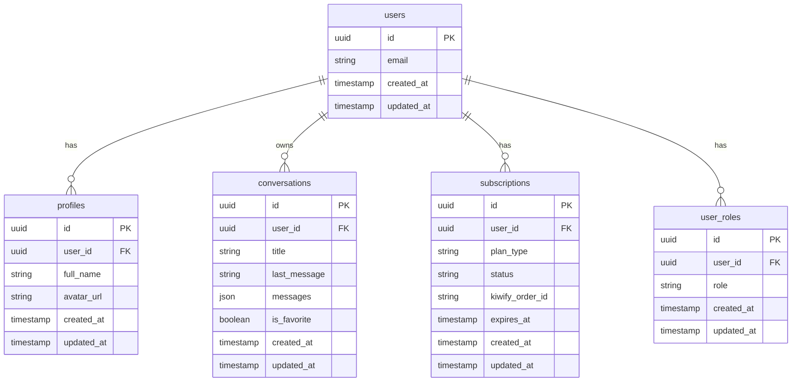

# Banco de Dados - Estrutura e Esquema

## 🗄️ Visão Geral

O Sistema Start utiliza **PostgreSQL** através do **Supabase** como banco de dados principal, implementando Row Level Security (RLS) para controle de acesso granular.

## 📊 Diagrama Entidade-Relacionamento



## 📋 Estrutura das Tabelas

### 👤 profiles
Armazena informações do perfil do usuário.

```sql
CREATE TABLE profiles (
  id UUID DEFAULT gen_random_uuid() PRIMARY KEY,
  user_id UUID REFERENCES auth.users(id) ON DELETE CASCADE,
  full_name TEXT,
  avatar_url TEXT,
  created_at TIMESTAMP WITH TIME ZONE DEFAULT NOW(),
  updated_at TIMESTAMP WITH TIME ZONE DEFAULT NOW()
);
```

**Campos:**
- `id`: Chave primária (UUID)
- `user_id`: Referência ao usuário do Supabase Auth
- `full_name`: Nome completo do usuário
- `avatar_url`: URL do avatar do usuário
- `created_at`: Data de criação
- `updated_at`: Data da última atualização

**Políticas RLS:**
```sql
-- Usuários podem apenas ver e editar seu próprio perfil
CREATE POLICY "Users can view own profile" ON profiles
FOR SELECT USING (user_id = auth.uid());

CREATE POLICY "Users can update own profile" ON profiles
FOR UPDATE USING (user_id = auth.uid());
```

### 💬 conversations
Armazena as conversas entre usuários e a IA.

```sql
CREATE TABLE conversations (
  id UUID DEFAULT gen_random_uuid() PRIMARY KEY,
  user_id UUID REFERENCES auth.users(id) ON DELETE CASCADE,
  title TEXT NOT NULL,
  last_message TEXT,
  messages JSONB DEFAULT '[]'::jsonb,
  is_favorite BOOLEAN DEFAULT FALSE,
  created_at TIMESTAMP WITH TIME ZONE DEFAULT NOW(),
  updated_at TIMESTAMP WITH TIME ZONE DEFAULT NOW()
);
```

**Campos:**
- `id`: Chave primária (UUID)
- `user_id`: Proprietário da conversa
- `title`: Título da conversa
- `last_message`: Última mensagem para preview
- `messages`: Array JSON com todas as mensagens
- `is_favorite`: Se a conversa está marcada como favorita
- `created_at`: Data de criação
- `updated_at`: Data da última atualização

**Estrutura do JSON `messages`:**
```typescript
interface Message {
  id: string;
  content: string;
  sender: 'user' | 'ai';
  timestamp: string; // ISO string
}
```

**Políticas RLS:**
```sql
-- Usuários podem apenas acessar suas próprias conversas
CREATE POLICY "Users can access own conversations" ON conversations
FOR ALL USING (user_id = auth.uid());
```

**Índices:**
```sql
-- Otimização para busca por usuário
CREATE INDEX idx_conversations_user_id ON conversations(user_id);

-- Otimização para ordenação por data
CREATE INDEX idx_conversations_updated_at ON conversations(updated_at DESC);

-- Otimização para busca de favoritos
CREATE INDEX idx_conversations_favorites ON conversations(user_id, is_favorite) 
WHERE is_favorite = true;
```

### 💳 subscriptions
Controla o status de assinatura dos usuários.

```sql
CREATE TABLE subscriptions (
  id UUID DEFAULT gen_random_uuid() PRIMARY KEY,
  user_id UUID REFERENCES auth.users(id) ON DELETE CASCADE,
  plan_type TEXT DEFAULT 'free',
  status TEXT DEFAULT 'inactive',
  kiwify_order_id TEXT UNIQUE,
  expires_at TIMESTAMP WITH TIME ZONE,
  created_at TIMESTAMP WITH TIME ZONE DEFAULT NOW(),
  updated_at TIMESTAMP WITH TIME ZONE DEFAULT NOW()
);
```

**Campos:**
- `id`: Chave primária (UUID)
- `user_id`: Usuário da assinatura
- `plan_type`: Tipo do plano ('free', 'premium', 'pro')
- `status`: Status da assinatura ('active', 'inactive', 'expired')
- `kiwify_order_id`: ID do pedido no Kiwify
- `expires_at`: Data de expiração da assinatura
- `created_at`: Data de criação
- `updated_at`: Data da última atualização

**Políticas RLS:**
```sql
-- Usuários podem ver apenas sua própria assinatura
CREATE POLICY "Users can view own subscription" ON subscriptions
FOR SELECT USING (user_id = auth.uid());

-- Apenas admins podem modificar assinaturas
CREATE POLICY "Only admins can modify subscriptions" ON subscriptions
FOR ALL USING (
  EXISTS (
    SELECT 1 FROM user_roles 
    WHERE user_id = auth.uid() AND role = 'admin'
  )
);
```

### 🔐 user_roles
Sistema de controle de permissões.

```sql
CREATE TABLE user_roles (
  id UUID DEFAULT gen_random_uuid() PRIMARY KEY,
  user_id UUID REFERENCES auth.users(id) ON DELETE CASCADE,
  role TEXT DEFAULT 'user',
  created_at TIMESTAMP WITH TIME ZONE DEFAULT NOW(),
  updated_at TIMESTAMP WITH TIME ZONE DEFAULT NOW(),
  UNIQUE(user_id, role)
);
```

**Campos:**
- `id`: Chave primária (UUID)
- `user_id`: Usuário com a role
- `role`: Tipo de permissão ('user', 'admin')
- `created_at`: Data de criação
- `updated_at`: Data da última atualização

**Roles Disponíveis:**
- `user`: Usuário regular
- `admin`: Administrador do sistema

**Políticas RLS:**
```sql
-- Usuários podem ver apenas suas próprias roles
CREATE POLICY "Users can view own roles" ON user_roles
FOR SELECT USING (user_id = auth.uid());

-- Apenas admins podem gerenciar roles
CREATE POLICY "Only admins can manage roles" ON user_roles
FOR ALL USING (
  EXISTS (
    SELECT 1 FROM user_roles 
    WHERE user_id = auth.uid() AND role = 'admin'
  )
);
```

## 🔧 Funções do Banco

### make_user_admin
Função para promover um usuário a administrador.

```sql
CREATE OR REPLACE FUNCTION make_user_admin(user_email TEXT)
RETURNS VOID AS $$
DECLARE
  target_user_id UUID;
BEGIN
  -- Busca o ID do usuário pelo email
  SELECT id INTO target_user_id 
  FROM auth.users 
  WHERE email = user_email;
  
  IF target_user_id IS NULL THEN
    RAISE EXCEPTION 'User not found with email: %', user_email;
  END IF;
  
  -- Insere a role de admin
  INSERT INTO user_roles (user_id, role)
  VALUES (target_user_id, 'admin')
  ON CONFLICT (user_id, role) DO NOTHING;
END;
$$ LANGUAGE plpgsql SECURITY DEFINER;
```

## 🔄 Triggers e Automações

### Atualização Automática de Timestamps
```sql
-- Função para atualizar updated_at
CREATE OR REPLACE FUNCTION update_updated_at_column()
RETURNS TRIGGER AS $$
BEGIN
  NEW.updated_at = NOW();
  RETURN NEW;
END;
$$ LANGUAGE plpgsql;

-- Triggers para cada tabela
CREATE TRIGGER update_profiles_updated_at
  BEFORE UPDATE ON profiles
  FOR EACH ROW EXECUTE FUNCTION update_updated_at_column();

CREATE TRIGGER update_conversations_updated_at
  BEFORE UPDATE ON conversations
  FOR EACH ROW EXECUTE FUNCTION update_updated_at_column();

CREATE TRIGGER update_subscriptions_updated_at
  BEFORE UPDATE ON subscriptions
  FOR EACH ROW EXECUTE FUNCTION update_updated_at_column();

CREATE TRIGGER update_user_roles_updated_at
  BEFORE UPDATE ON user_roles
  FOR EACH ROW EXECUTE FUNCTION update_updated_at_column();
```

### Criação Automática de Perfil
```sql
-- Trigger para criar perfil automaticamente
CREATE OR REPLACE FUNCTION handle_new_user()
RETURNS TRIGGER AS $$
BEGIN
  INSERT INTO profiles (user_id, full_name)
  VALUES (NEW.id, NEW.raw_user_meta_data->>'full_name');
  RETURN NEW;
END;
$$ LANGUAGE plpgsql SECURITY DEFINER;

CREATE TRIGGER on_auth_user_created
  AFTER INSERT ON auth.users
  FOR EACH ROW EXECUTE FUNCTION handle_new_user();
```

## 📈 Otimizações e Performance

### Estratégias de Indexação
```sql
-- Índices compostos para queries frequentes
CREATE INDEX idx_conversations_user_updated 
ON conversations(user_id, updated_at DESC);

-- Índices parciais para melhor performance
CREATE INDEX idx_active_subscriptions 
ON subscriptions(user_id, expires_at) 
WHERE status = 'active';

-- Índices para busca de texto
CREATE INDEX idx_conversations_search 
ON conversations USING gin(to_tsvector('portuguese', title || ' ' || last_message));
```

### Particionamento (Futuro)
Para grandes volumes de dados:
```sql
-- Exemplo de particionamento por data
CREATE TABLE conversations_y2024m01 
PARTITION OF conversations
FOR VALUES FROM ('2024-01-01') TO ('2024-02-01');
```

## 🔍 Queries Comuns

### Buscar conversas do usuário
```sql
SELECT id, title, last_message, updated_at, is_favorite
FROM conversations
WHERE user_id = $1
ORDER BY updated_at DESC
LIMIT 20;
```

### Verificar status de assinatura
```sql
SELECT plan_type, status, expires_at
FROM subscriptions
WHERE user_id = $1 
  AND status = 'active'
  AND (expires_at IS NULL OR expires_at > NOW());
```

### Buscar conversas favoritas
```sql
SELECT *
FROM conversations
WHERE user_id = $1 AND is_favorite = true
ORDER BY updated_at DESC;
```

## 📊 Monitoramento e Métricas

### Queries de Análise
```sql
-- Total de conversas por usuário
SELECT user_id, COUNT(*) as total_conversations
FROM conversations
GROUP BY user_id;

-- Usuários mais ativos
SELECT u.email, COUNT(c.id) as conversation_count
FROM auth.users u
LEFT JOIN conversations c ON u.id = c.user_id
GROUP BY u.id, u.email
ORDER BY conversation_count DESC;

-- Estatísticas de assinatura
SELECT plan_type, status, COUNT(*) as count
FROM subscriptions
GROUP BY plan_type, status;
```

## 🛡️ Segurança

### Row Level Security (RLS)
Todas as tabelas têm RLS habilitado para garantir que usuários apenas acessem seus próprios dados.

### Backup e Recuperação
- Backups automáticos via Supabase
- Point-in-time recovery disponível
- Réplicas para alta disponibilidade

### Auditoria
```sql
-- Log de mudanças importantes
CREATE TABLE audit_log (
  id UUID DEFAULT gen_random_uuid() PRIMARY KEY,
  table_name TEXT NOT NULL,
  operation TEXT NOT NULL,
  user_id UUID,
  old_data JSONB,
  new_data JSONB,
  created_at TIMESTAMP WITH TIME ZONE DEFAULT NOW()
);
```

---

Esta estrutura de banco foi projetada para ser **escalável**, **segura** e **performática**, seguindo as melhores práticas de design de banco de dados. 